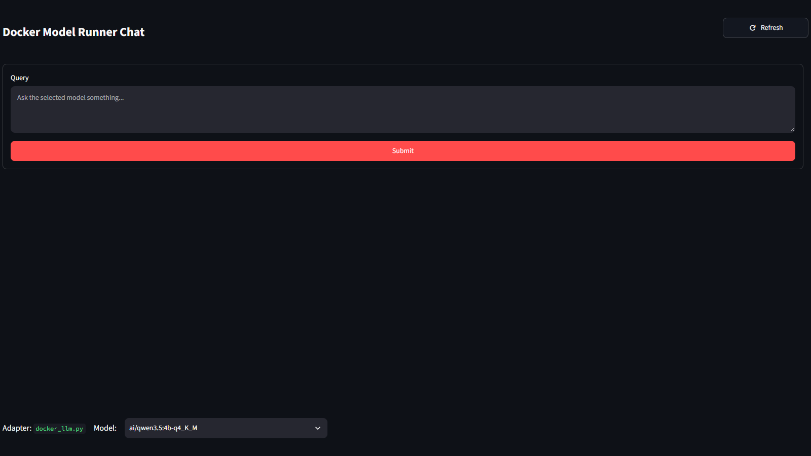

# Python Docker Model

Python Docker Model is a Streamlit application for running configurable query workflows against local models exposed by Docker Model Runner. A workflow can pass input directly to output or send it through a selected model first, while the interface shows each step as a numbered status card.



## Repository layout

The repository root contains project guidance, documentation, and OpenSpec planning artifacts. The buildable application lives in `Python/`.

```text
.
|-- .agents/                 Project-specific agent skills
|-- .codex/                  Codex project identity
|-- .github/                 GitHub automation
|-- documentation/           Supporting documentation and images
|-- openspec/                Specifications and proposed changes
|-- Python/                  Buildable Streamlit project
|   |-- .streamlit/          Streamlit configuration
|   |-- src/                 Application source
|   |-- tests/               Automated tests
|   |-- main.py              Streamlit entry point
|   |-- requirements.txt     Python dependencies
|   |-- run.bat              Background launcher
|   `-- setup.bat            Local environment setup
|-- AGENTS.md
|-- LICENSE
`-- README.md
```

## Prerequisites

- Windows with Python 3.10 or newer
- Docker Desktop with Docker Model Runner enabled
- At least one locally available model

For example:

```powershell
docker model pull ai/smollm2
docker model list
```

## Setup and run

Run the project scripts from the buildable project directory:

```powershell
cd Python
.\setup.bat
.\run.bat
```

Then open <http://localhost:8501>.

`run.bat` starts Streamlit in the background without opening a persistent command window. Running it again reuses the listener already on port 8501. Runtime logs are written to `Python/.run/`.

To run Streamlit in the foreground instead:

```powershell
cd Python
.\.venv\Scripts\python.exe -m streamlit run main.py
```

## Workflows

Workflow definitions live in `Python/src/Workflows/workflow.json`.

- **Workflow 1** passes the query directly to the output step.
- **Workflow 2** sends the query through the selected Docker model before displaying the response.

The footer provides model and workflow selectors. Changing either selection resets the current workflow run.

## Tests

```powershell
cd Python
.\.venv\Scripts\python.exe -m unittest discover -s tests -p "test*.py"
```

GitHub Actions runs the same suite for pushes and pull requests.

## Development workflow

OpenSpec artifacts remain at the repository root so they describe the repository as a whole. Source paths in specifications start with `Python/` to make the project boundary explicit.

See [documentation/README.md](documentation/README.md) for links to the main implementation areas.

## License

This project is available under the [MIT License](LICENSE).
